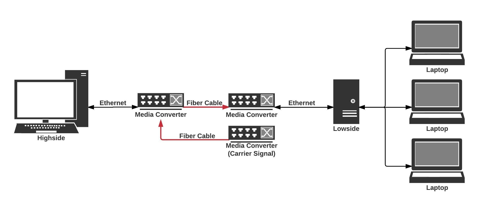
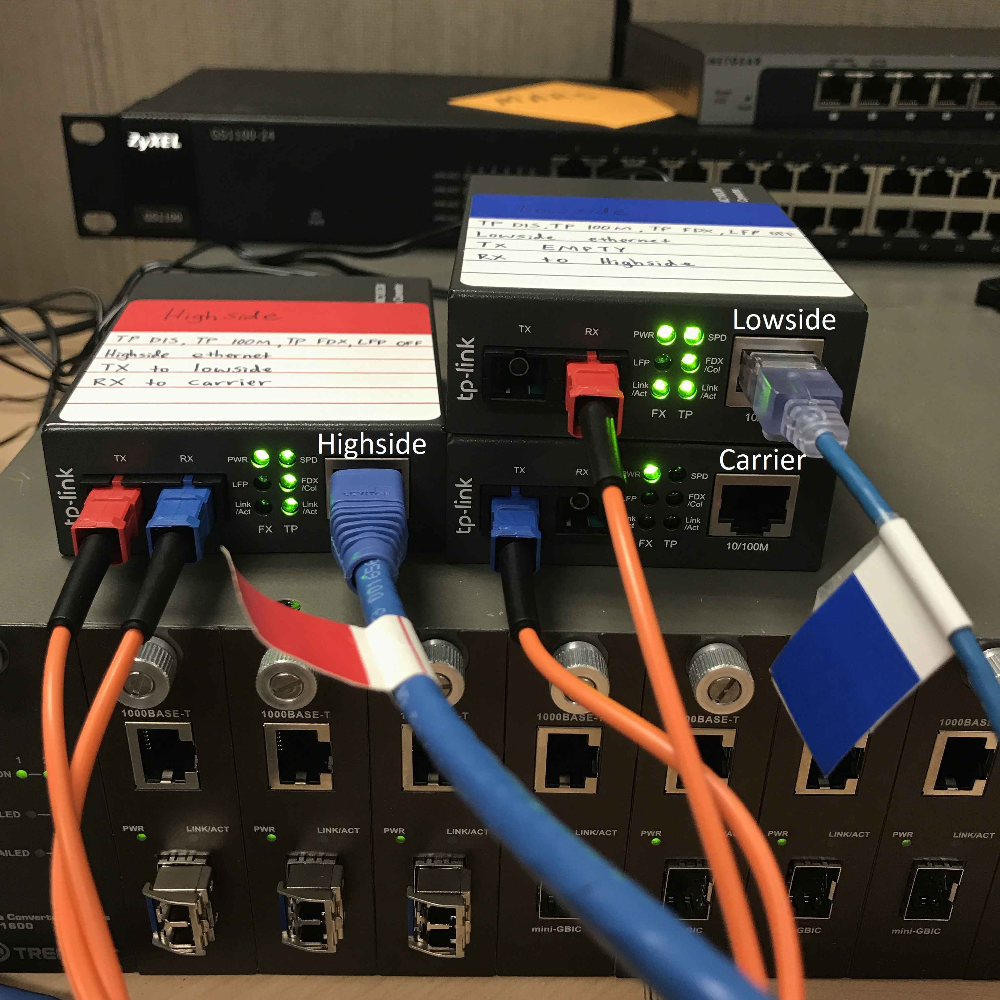
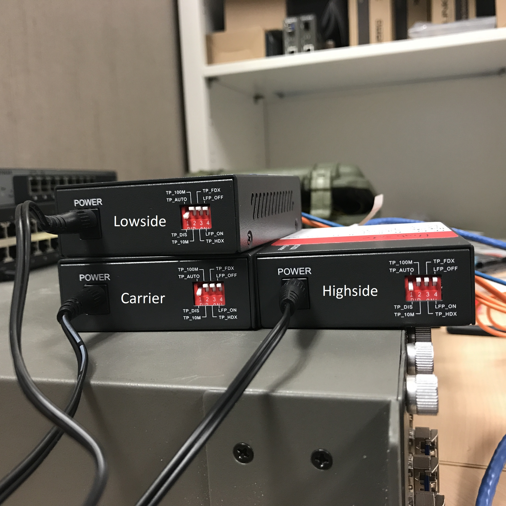
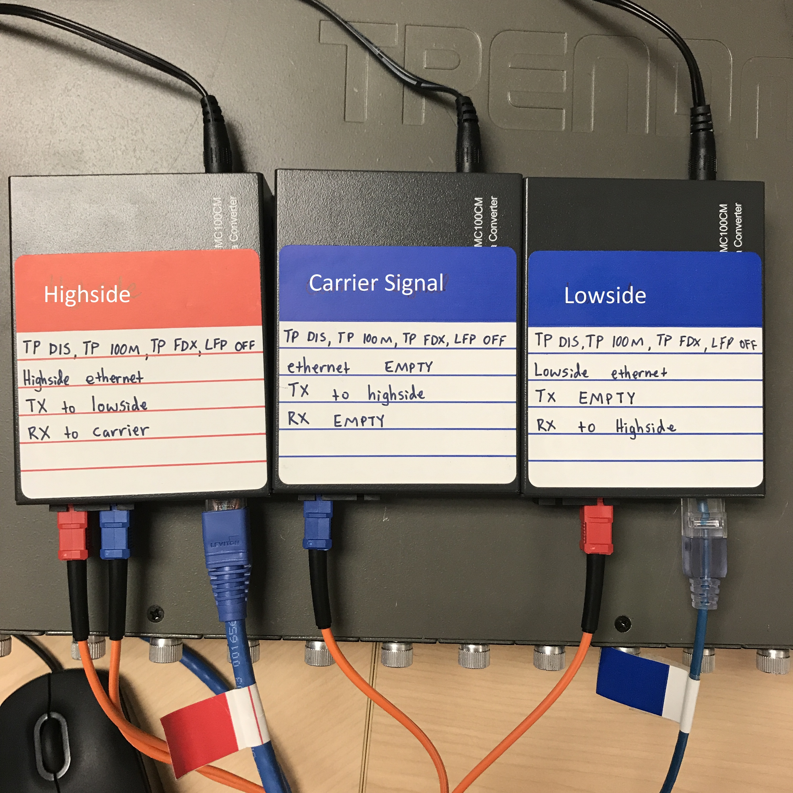

# Hardware

Build a functional two-way network, using two of your media converters and test the software before disconnecting. 

To ease troubleshooting pains, one-way hardware configuration should be your last step.

***

| Item  |   Amazon Link    | Qty |
| -------- |:-------------:|:-----:|
| Ethernet Cables | [Amazon](https://www.amazon.com/Cable-Matters-160021-Snagless-Ethernet/dp/B00E5I7VJG/ref=sr_1_3?s=electronics&ie=UTF8&qid=1501779502&sr=1-3&keywords=ethernet+cables) | 2 |
| Fiber Optic Cable| [Amazon](https://www.amazon.com/gp/product/B000067SPA/ref=od_aui_detailpages00?ie=UTF8&psc=1)     |   1 |
| TP Link Multi-mode Media Converters (Model: MC100CM) | [Amazon](https://www.amazon.com/gp/product/B0034CMZIG/ref=od_aui_detailpages00?ie=UTF8&psc=1)      |    3 |

***
Any ethernet cable should work.

The fiber optic cables I used have a clamshell holding the TX/RX cables together. This easily snaps off.

I chose these media converters because they have the ability to turn LFP [(link fault pass)](http://www.e1-converter.com/TechnicalSupport/link_fault_pass_through.html) **OFF**. LFP is a way for the hardware to error check the connections. 

TP Link [recommended](http://www.tp-link.com/us/faq-1135.html) **FORCE** instead of auto because the communication is between two media converters. 

***

The purpose of this hardware configuration is to convince the lowside machine that there *is* a functioning connection, so it will listen properly. While highside receives the carrier signal, it sends a "connected!" packet to lowside.

***

| Hardware Configuration|
|:---:|
| Block Diagram |
||
|   |
| Physical Configuration  |
||
|   |
|Switches |
||
|   |
|Topside Labels|
|
